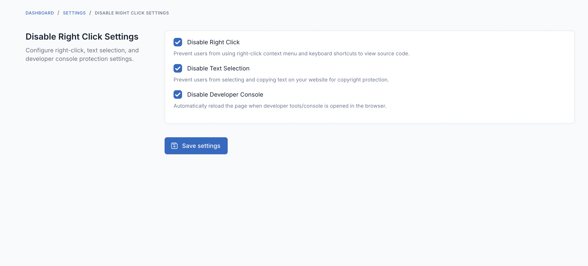

# FOB Disable Right Click

A Botble CMS plugin to disable right-click, text selection, and developer console on your website to protect your content.

## Features

- **Disable Right Click**: Prevent users from using right-click context menu
- **Disable Text Selection**: Prevent users from selecting and copying text
- **Disable Developer Console**: Automatically reload page when DevTools/Console is opened
- **Keyboard Shortcut Blocking**: Block common shortcuts like F12, Ctrl+Shift+I, Ctrl+U, etc.
- **Multi-language Support**: Translations available in 42 languages

## Requirements

- Botble CMS 7.6.0 or higher
- PHP 8.2 or higher

## Installation

1. Download the plugin
2. Extract to `platform/plugins/fob-disable-right-click`
3. Go to Admin Panel → Plugins
4. Activate the plugin
5. Go to Admin Panel → Settings → Disable Right Click to configure

## Configuration

Navigate to **Admin Panel → Settings → Disable Right Click** to configure:

1. **Disable Right Click** (Enabled by default)
   - Prevents right-click context menu
   - Blocks keyboard shortcuts (F12, Ctrl+Shift+I, Ctrl+Shift+J, Ctrl+U, etc.)

2. **Disable Text Selection** (Disabled by default)
   - Prevents text selection with mouse
   - Prevents text copying

3. **Disable Developer Console** (Disabled by default)
   - Detects when DevTools/Console is opened
   - Automatically reloads the page when detected

## Screenshot

## How It Works

The plugin injects JavaScript code into your website's frontend that:

- Intercepts right-click events and prevents the context menu
- Blocks keyboard shortcuts commonly used to inspect page source
- Applies CSS styles to prevent text selection
- Monitors browser window size and console access to detect DevTools
- Only runs on public pages (not in admin panel)

## Important Notes

⚠️ **This is a client-side protection** and can be bypassed by experienced users. It serves as a deterrent for casual users but should not be relied upon as the sole method of content protection.

For better content protection, consider:
- Watermarking images
- Using proper copyright notices
- Implementing server-side security measures
- Using CDN protection services

## Support

For issues, questions, or contributions, please visit:
- [Friends of Botble](https://friendsofbotble.com)
- [Botble Documentation](https://docs.botble.com)

## License

This plugin is open-sourced software licensed under the [MIT license](LICENSE).

## Author

**Friends of Botble**
- Website: https://friendsofbotble.com
